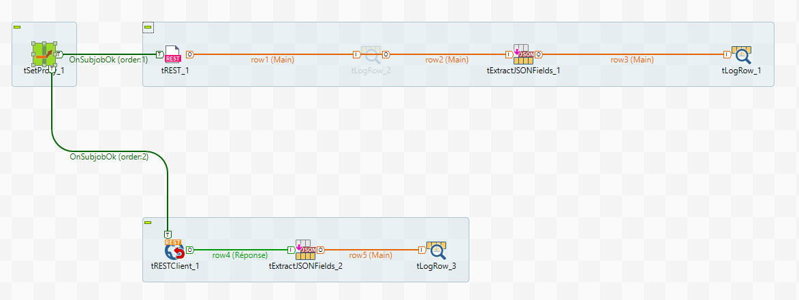
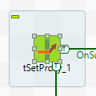
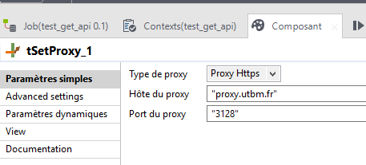
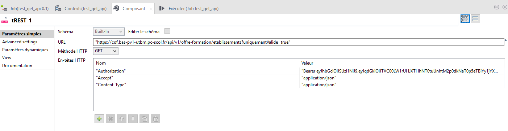
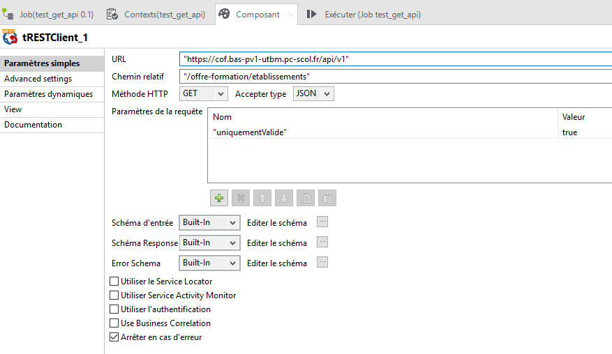
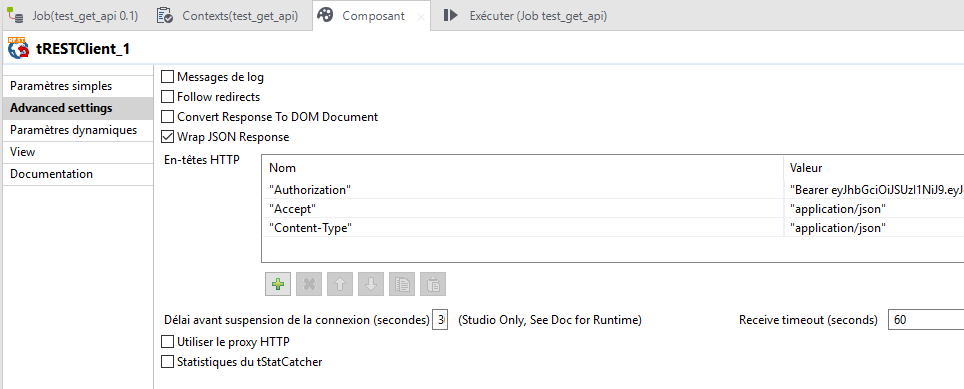
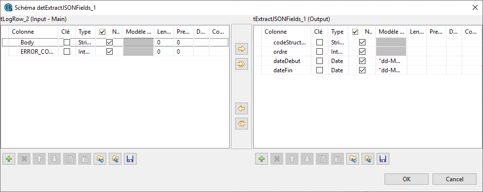
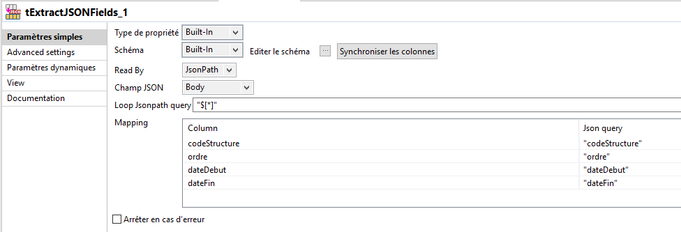
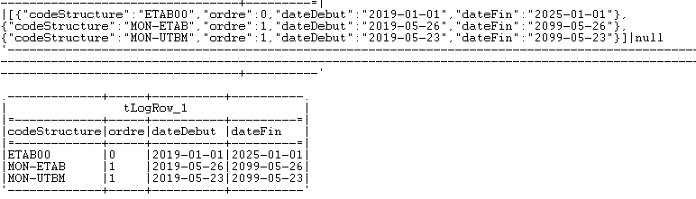

# API Pegase

Un exemple d'utilisation de l'API Pegase avec Talend, derrière un proxy.



## Configuration du proxy 

Pour configurer l'utilisation d'un proxy, nous utilisons le composant tSetProxy 

Nous le configurons de la manière suivante :



## Récupération de la liste des établissements

Dans cet exemple, nous partons du principe que l'authentification a déjà été effectuée et que le token est déjà connu. Deux méthodes sont possibles soit en utilisant le composant tRest soit le composant tRestClient.

### Avec le composant tRest



Saisir l'url de votre API : 

https://cof.bas-pv1-xxxx.pc-scol.fr/api/v1/offre-formation/etablissements?uniquementValide=true

Ainsi que la méthode HTTP, **GET** dans notre cas

Dans les en-têtes HTTP, saisir les trois valeurs suivantes  : 

- **"Authorization"** :  il faut saisir ici le token d'authentification sous la forme **"Bearer abba1234xyz"**
- **"Accept"** : **"application/json"**
- **"Content-type"** : **"application/json"**
- nous récupérerons les informations dans les colonnes Body (contenant notre json) et ERROR_CODE (200)

### Avec le composant tRestClient

Le composant tRestClient est similaire au composant tRest



Saisir les champs : 

- URL : **"https://cof.bas-pv1-xxxx.pc-scol.fr/api/v1"**

- Chemin relatif : **"/offre-formation/etablissements"**

  Choisir la méthode HTTP **GET**

  Ajouter le paramètre de la requête "uniquementValide" avec comme valeur  **true**

Dans l'onglet **advanced settings** du composant, il faut rajouter les en-têtes HTTP suivantes:

- **"Authorization"** :  il faut saisir ici le token d'authentification sous la forme **"Bearer abba1234xyz"**

- **"Accept"** : **"application/json"**

- **"Content-type"** : **"application/json"**

  

### Traitement du json

La sortie des composants tRest et tRestClient est similaire, notre json réponse se trouvant dans les deux cas dans la colonne body. Il faut maintenant traiter les données du json à l'aide du composant **tExtractJSONFields** qui nous permettra d'extraire les données du json en colonnes. Dans notre cas, notre json est composé comme cela :

```json
[
  {
    "codeStructure": "string",
    "dateDebut": "string",
    "dateFin": "string",
    "ordre": 0
  }
]
```

Nous devons créer un schéma de sortie du composant **tExtractJSONFields** correspondant à ces quatre champs comme ci-dessous :

Nous devons ensuite faire le mapping entre les champs json et les champs de sortie en utilisant le formalisme JsonPath. On fait correspondre de la façon suivante :

| Champs de sortie | Champs json     |
| ---------------- | --------------- |
| codeStructure    | "codeStructure" |
| ordre            | "ordre"         |
| dateDebut        | "dateDebut"     |
| dateFin          | "dateFin"       |



Nous obtenons les retours suivants :



Le premier tableau correspond à la sortie du composant tRest / et tRestClient. Le second tableau correspond à la sortie du composant tExtractJSONFields.

